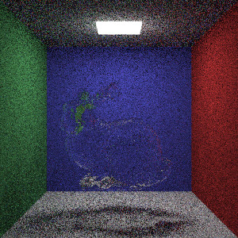
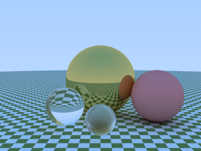

# CGLearning

TaiChi里面没有什么，就一些跟胡渊明老师的CG课写的一些笔记。

## RayTracing

### 最终案例，Bunny4K.ply

研读了ply文件格式后，我自己写了一个ply的读取器，还行。

因为是写着玩，没有任何多线程优化。

我手上的Bunny4K.ply有点残破，不知为何有几个缺口，而Bunny10k很完整，但它太大了，不适合测试。

本次测试采用的一次中值滤波和20次双边滤波。

运行，采样次数=10

原始图像：

降噪后的图像：

运行，采样次数=100

原始图像：

降噪后的图像：

### 内置模型的展示

内置模型：球、平面、长方体（基于平面）、三角形。

内置材质：金属（包含毛金属）、镜面反射（二者中有个过度参数）漫反射、雾、电介质（包含毛玻璃）、混合材质（上述两种混合）

内置纹理：常色、贴图、噪声（内置3种）、混合材质

自己编写了一个自由变换方式（本质是一个模型）

运行，采样次数=100：

原始图像：

降噪后的图像：

将下面两个玻璃球分别换为一个毛玻璃地球和一个漫反射噪声球，并将其他金属材质改为毛金属材质。

这是内置的模仿大理石纹理的噪声，用于球确实有点奇怪。

运行，采样次数=100：

原始图像：

降噪后的图像：

### 编写时写的测试输出

