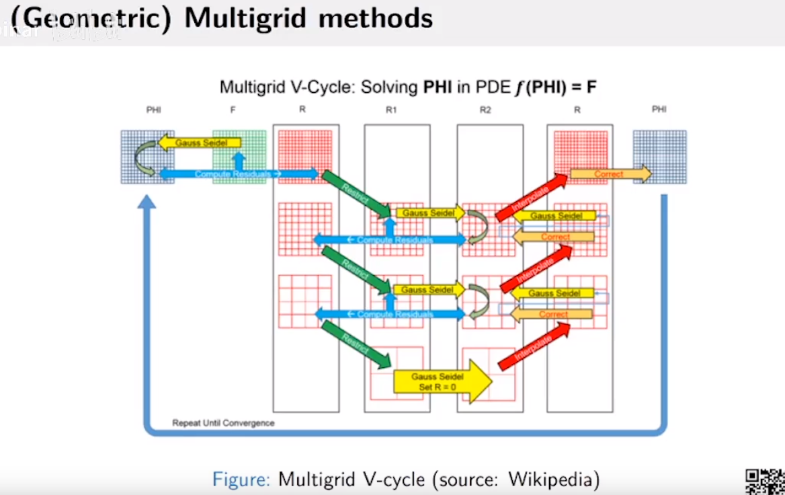

代码

# Eulerian fluid simulation

**材料导数**

>   用D表示材料关于什么的导数。
>
>   -   本身的变化；
>   -   材质移动导致的变化。

>   第二项粘度项一般越小越好，所以有时甚至不要，这样可以搓出好看的涡。

>   此处丢掉了粘度项。

>   第三步中，由于经过第二步等操作，会产生一定的散度，因此第三步中添加压强。

更复杂

>   Orange：blue

>   cell内除了一个点外是没有数值的，因此采用插值技术填充空间。
>
>   面积解释法：$黑*面积1=黄*面积黄+蓝*面积蓝+绿*面积绿+红*面积红$

不同方法都有不同的取舍。

>   位置x的速度为上一个时间步所在位置的速度。

但这个方法有问题。

粒子的移动十分复杂，不能简单用线性表示。

因此有更常用的方法。

>   RK2：显式中点法，用中点的速度表示现在的速度。
>
>   一般RK2就够用了，极少数情况使用RK3。

>   Eulerian在做加权平均的方法不可避免的会导致变糊问题，因此引入BFECC

一般图形学中$f$不为0。

>   中间17、18为近似拉普拉斯算子

>   纠错：$\nabla u_{i,j}=(u^x_{i+1,j}-u^x_{i,j}+u^y_{i,j+1}-u^y_{i,j})/\Delta x$

>   若$P_{i+1,j}$是固体，就去掉这个项，并将4给为3；
>
>   若是空气，则赋值为0；

大多数问题最后会转换为解线性系统的问题：

解决方法之间可以进行组合（下面案例是泊松方程的常用解）

>   图形学中，我们关注第三种，不存矩阵，用Matrix-free方式进行表示。

>   常用CG作为解决方案。

通用代码格式。

定义有很多种，这是其中一种。

另外一个提高收敛速度的方式：

>   你上一步的压强场和你这次的压强场的差别不大，因此可以直接使用，但并不是适用于所有流体模拟方式。
>
>   流体体积变小的原因是压强场求解不好。

>   restriction：合并为粗网格，减少线性系统的计算量。

>   无散可保持流体的体积不变。
>
>   但将矩阵迭代到无散需要很高的次数才能收敛。

