# TimeStep&Mess-spring

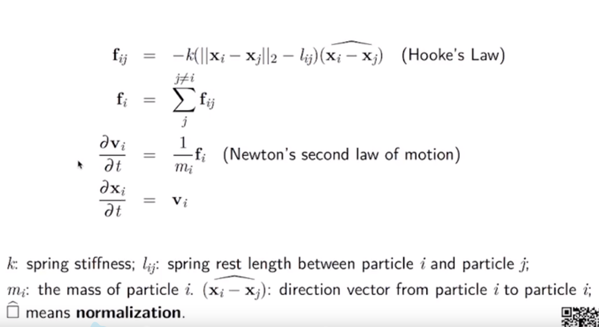

-   Hook's Law

显示积分器：

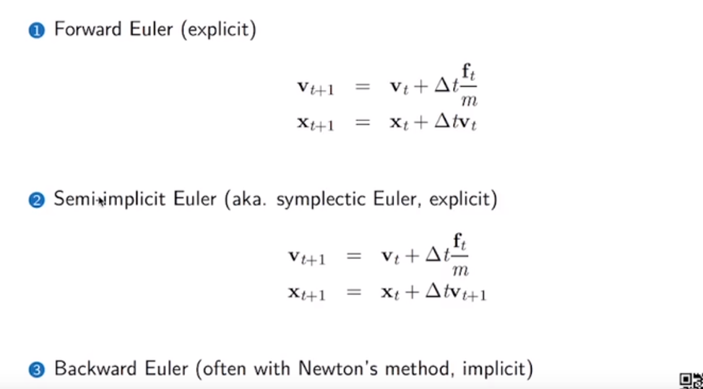

-   Time integration
-   symplectic Euler 是常用的欧拉方法

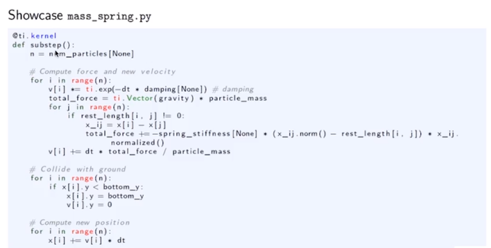

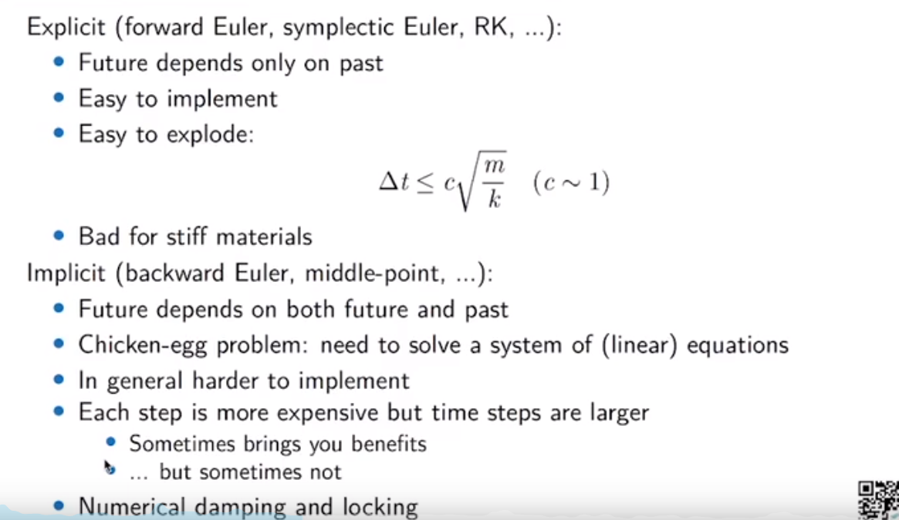

-   积分器相关

隐式积分器（Implicit Solver）：

-   缺点：复杂，需要更多优化与衡量，每一个time step会更加珍贵；
-   优点：允许更多容差；

Largrangian Implicit Solver：

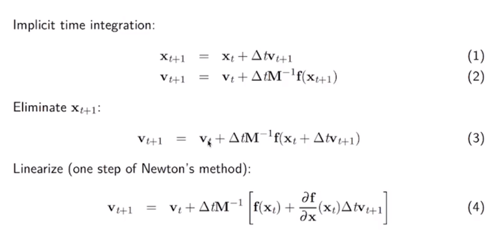

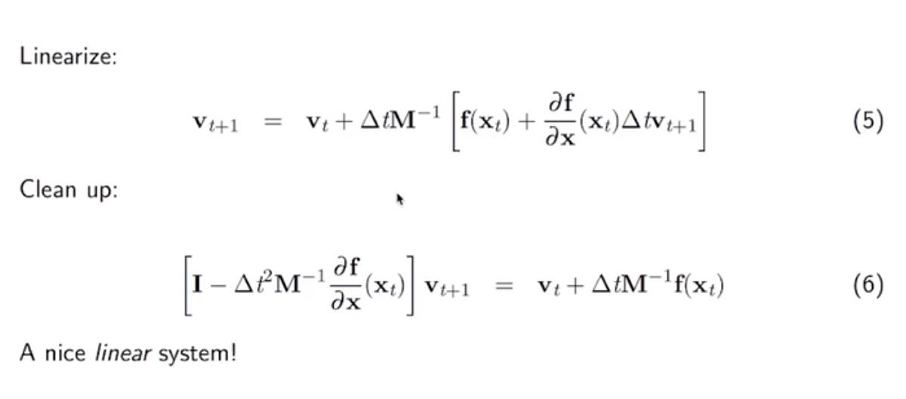

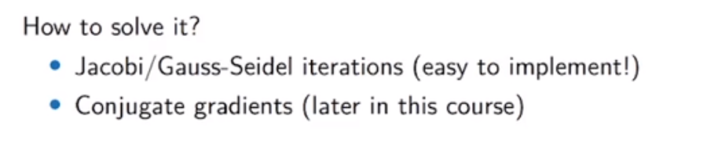

-   雅克比迭代；
-   共轭梯度；

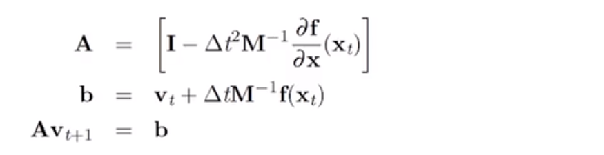

>   求逆是一个十分消耗资源的方法；
>
>   e.g. 稀疏矩阵的逆可能是稠密矩阵，存在爆显存的情况。

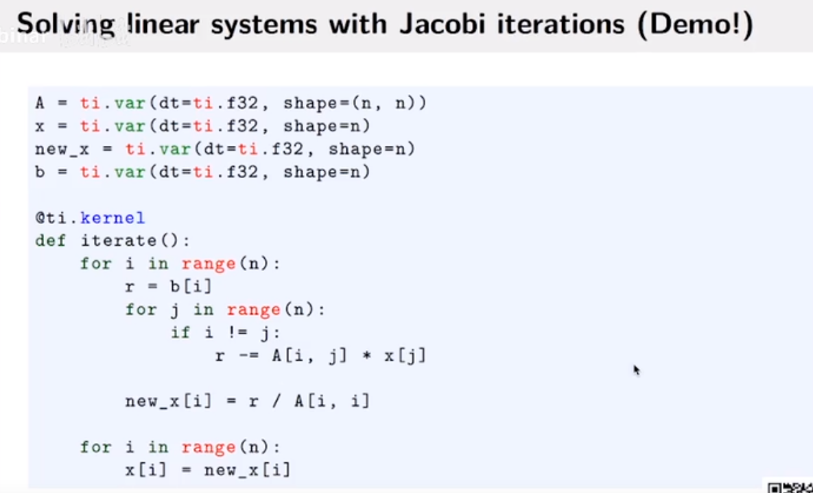

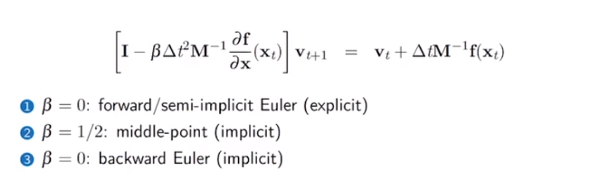

>   纠错：3的$\beta=1$；

# SPH

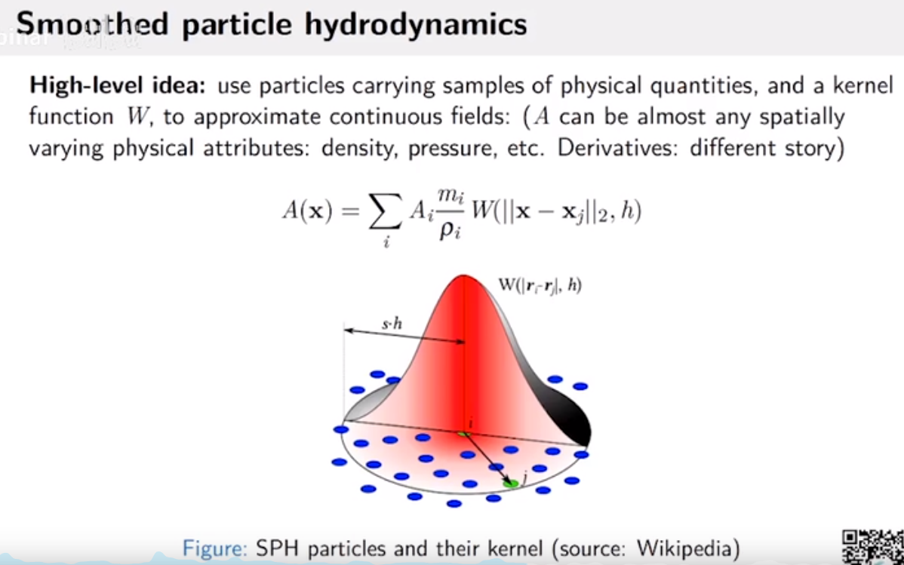

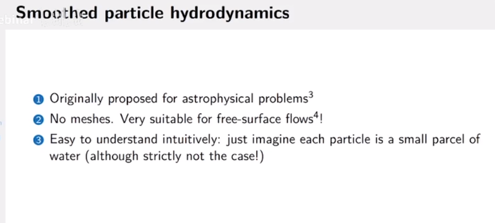

-   适合自由表面模拟；
    -   烟雾不包含自由表面，因为包含空气；

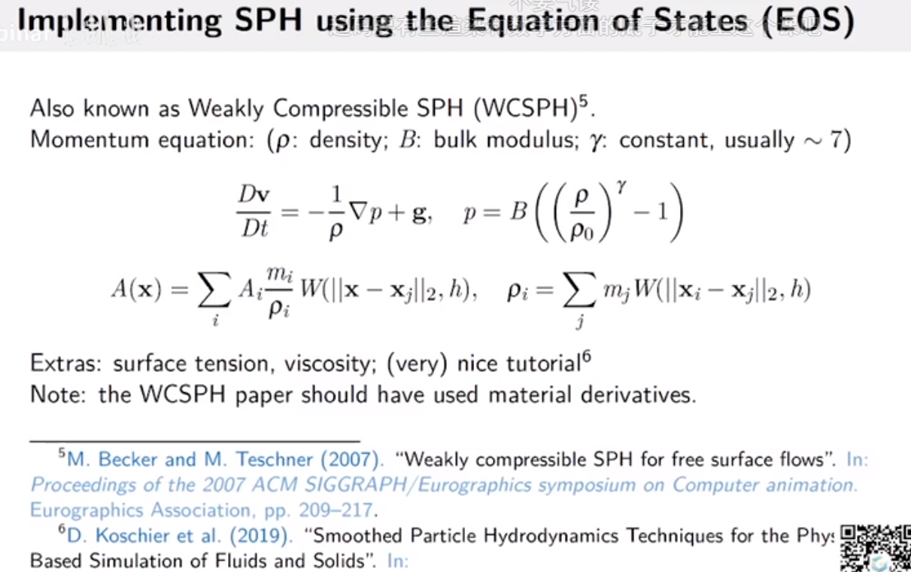

-   MCSPH是一个最简单SPH模拟；
-   $D$一般指定材料导数（跟着粒子动的一种导数）

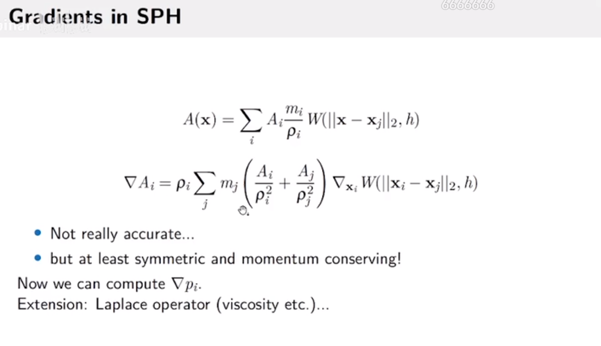

-   公式2可以保证公式的稳定性，特别是在粘度等模拟上。

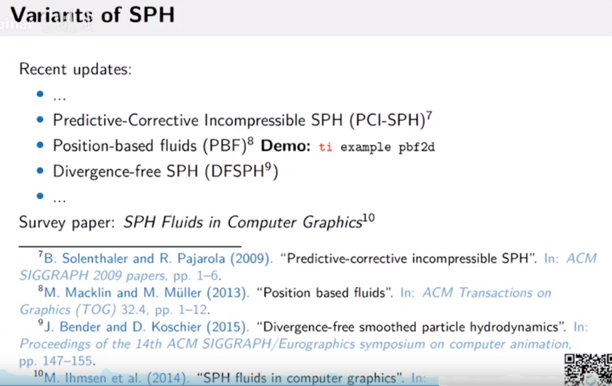

-   PCI-SPH：用了预测修正粒子速度的方法，降低了流体的散度对模拟的干扰。
-   DFSPH：让速度Divergence-free

更多模型：

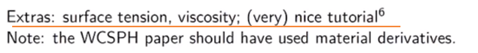

显式时间积分：

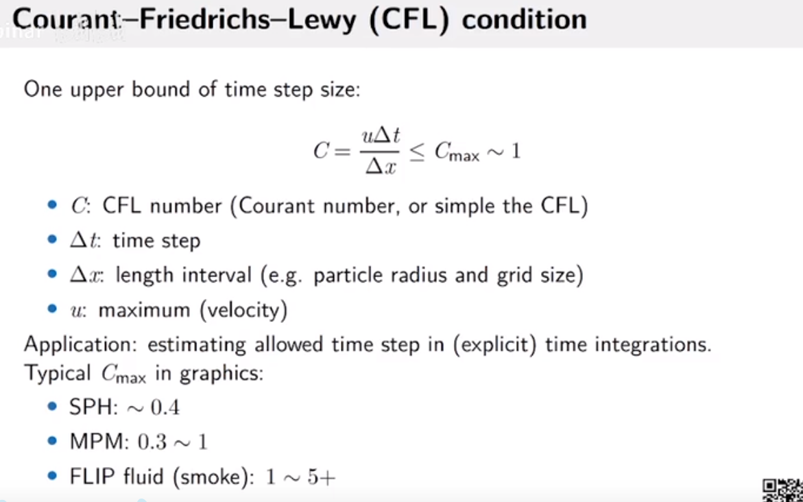

定义时间步长，不然会导致系统不稳定。

邻接表优化：

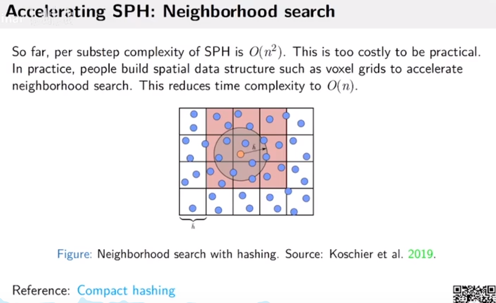

-   Conpact hashing是一个最新的空间优化方法。

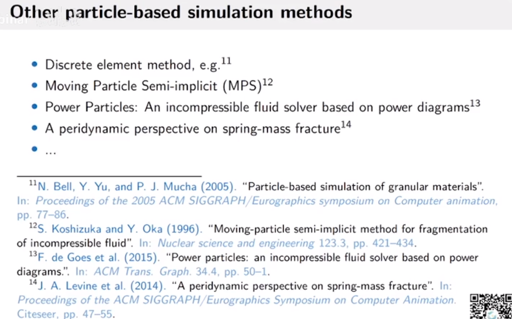

导出图片ORgifORmp4

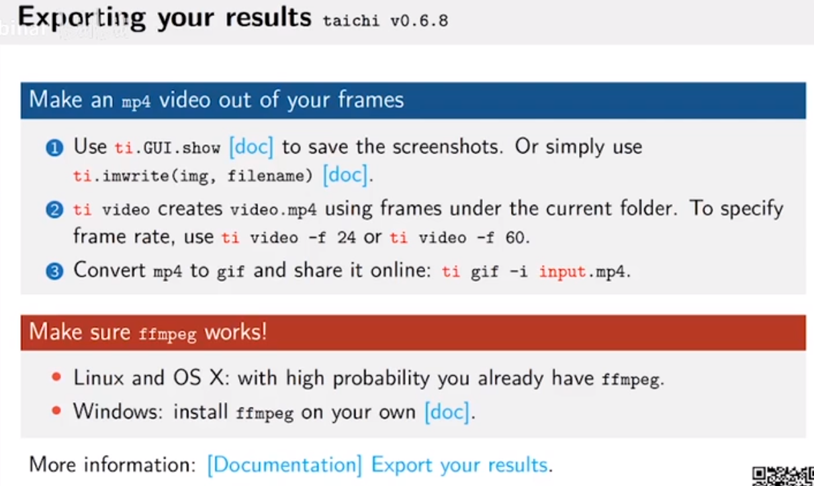

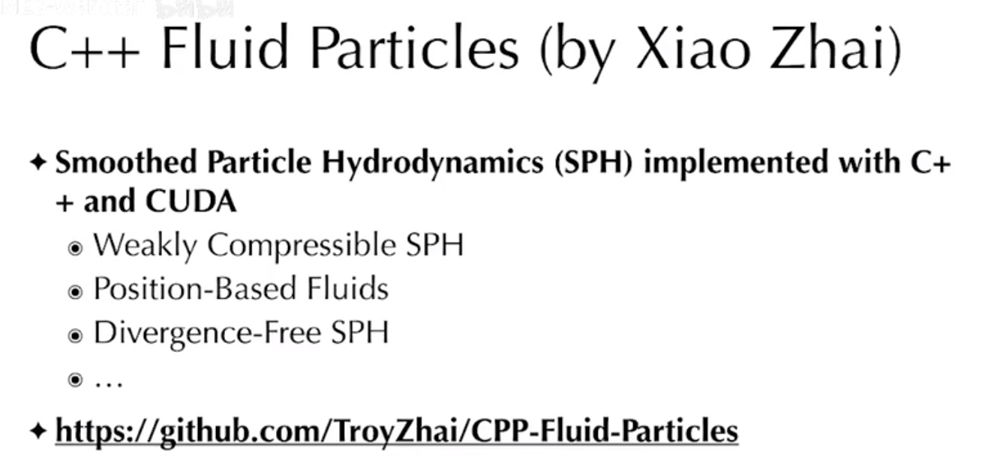