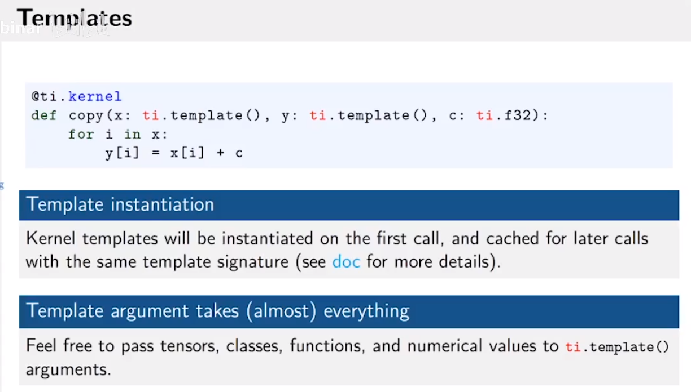

# TimeStep&Mess-spring

-   Hook's Law

显示积分器：

-   Time integration
-   symplectic Euler 是常用的欧拉方法

-   积分器相关

隐式积分器（Implicit Solver）：

-   缺点：复杂，需要更多优化与衡量，每一个time step会更加珍贵；
-   优点：允许更多容差；

Largrangian Implicit Solver：

-   雅克比迭代；
-   共轭梯度；

>   求逆是一个十分消耗资源的方法；
>
>   e.g. 稀疏矩阵的逆可能是稠密矩阵，存在爆显存的情况。

>   纠错：3的$\beta=1$；

# SPH

-   适合自由表面模拟；
    -   烟雾不包含自由表面，因为包含空气；

-   MCSPH是一个最简单SPH模拟；
-   $D$一般指定材料导数（跟着粒子动的一种导数）

-   公式2可以保证公式的稳定性，特别是在粘度等模拟上。

-   PCI-SPH：用了预测修正粒子速度的方法，降低了流体的散度对模拟的干扰。
-   DFSPH：让速度Divergence-free

更多模型：

显式时间积分：

定义时间步长，不然会导致系统不稳定。

邻接表优化：

-   Conpact hashing是一个最新的空间优化方法。

导出图片ORgifORmp4

# Elasticity

弹性和有限元教程：

描述弹性的方式：

>   deformation：形变
>
>   $J=形变前的体积/形变后的体积$

## 超弹性模型

>   Stress：材料内部的弹性力；
>
>   Strain：

材料微元之间会相互影响；

>   上述所有参数都和杨氏模量成正比；
>
>   应用场景各不相同；
>
>   Poisson ratio：材料保持自身体积的能力（Poisson ratio=0的橡皮筋，拉伸时，中间横截面面积不变）常用于可压缩元。

>   一般用Noe-Hookean模型；
>
>   当形变程度很小时，可以考虑采用Linear elasticity，因为一般不会旋转这类小元，且方程易解。

# Lagrangian finite elements on linear tetrahedral meshes

>   将连续PDE转换为离散微分几何元素
>
>   网站：有限元素周期表

公式1：$一个元素形变后的位置=静止的位置*F+b(offset)$

公式2：纠错$dx$不是$x$，

三角元素推导：

## Implicit linear trangular FEM simulation

>   M：质量矩阵，每个元素是这个元素的质量；

# TaiChi Features

## Objective data-oriented programming

同时支持面向数据和面向对象编程。

>   staticmethod：魔法指令，生成静态函数；

## Metaprogramming（元编程）

>   lazily instantiated：未实例化就不编译；

**维度无关编程：**

>   ti.grouped(y)：将y变量打包。

Tensor反射（自省）

>   判断是在编译器实现。

>   在编译器循环展开。

>   变量重命名。

## Differentiable Programming（可微编程）

-p：命令行查看；

-P：命令行查看，渲染；

-s：导出；

## Visualization

